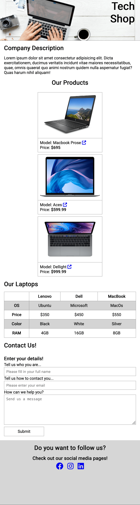
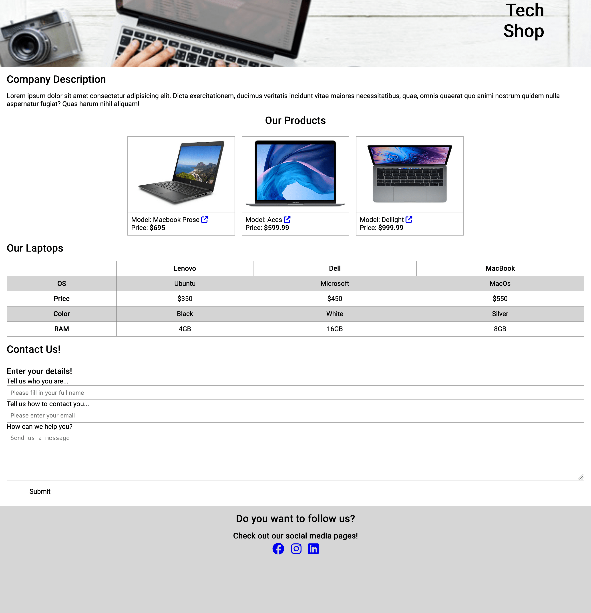

# UI Basics - Exam 2

In this project, I recreated the landing page for a computer store. The goal was to design a responsive and functional page using **HTML**, **CSS**, and some additional features like **FontAwesome icons**, **flexbox**, and **client-side form validation**. I made use of provided assets and followed the instructions to build a user-friendly and visually appealing page.

### Languages Used
- **HTML** for structuring the webpage
- **CSS** for styling the page
- **FontAwesome** for icons

### Project Overview

To start, I examined the provided `index.html` and `style.css` files, as well as the images in the `images` folder. The task involved completing the computer store landing page by following a set of requirements. Some of the main features I implemented include:

- Adding a background image to the header.
- Fixing the header position so it stays at the top.
- Using the `::after` pseudo-element to add FontAwesome icons to links with a specific attribute.
- Creating a responsive design for the product cards and making them adjust according to screen sizes (mobile/tablet/desktop).
- Designing a table with specific data about different laptops and adding a form for users to contact the store.
- Adding footer links with social media icons.

### Design Mock-ups

- **Mobile Preview**  
  

- **Desktop Preview**  
  

### Video Preview

[Video Preview](tech-shop-video-preview.mp4)

## Installation

1. Clone the repository:

   ```bash
   git clone <repository-url>
